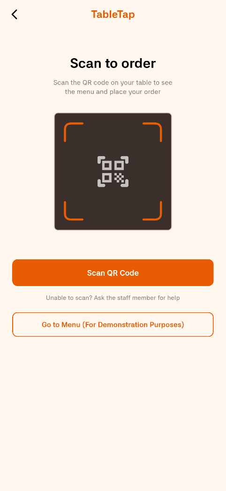
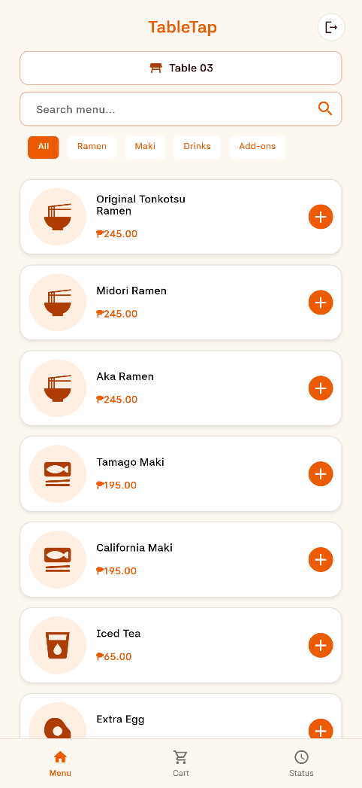
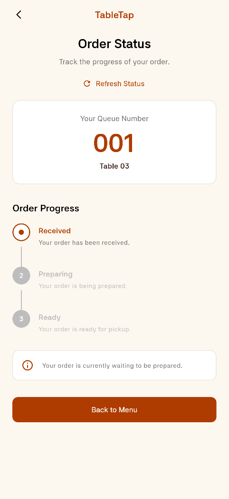
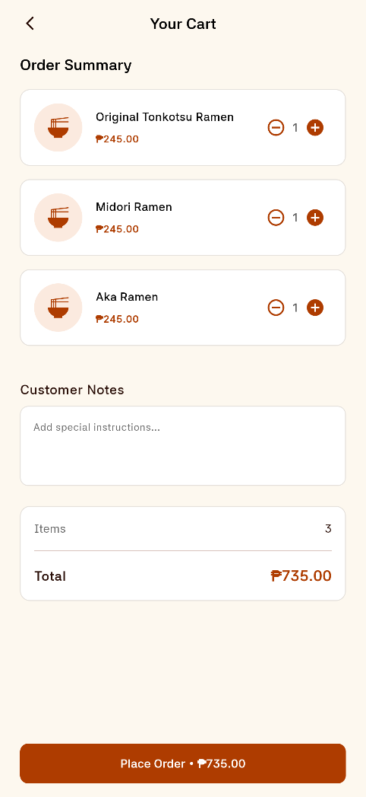
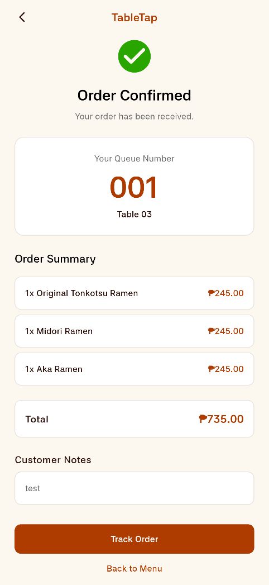
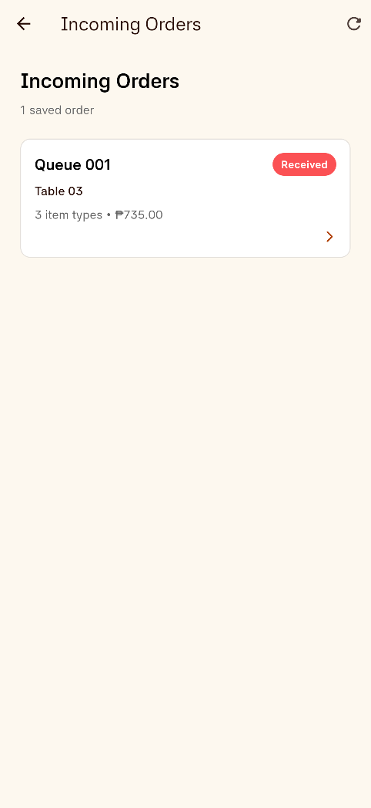

# TableTap

> A QR-based dine-in ordering app that allows customers to order from their table and lets staff manage incoming orders and order statuses.

**Live demo:** https://thebeancheese.github.io/tabletap/  
**Demo video:** [View the demo video documentation](docs/05-demo-video.md)  
**Course:** Applications Development and Emerging Technologies (6ADET), Holy Angel University  
**Authors:** [@thebeancheese](https://github.com/thebeancheese) and [@camillavillena-tech](https://github.com/camillavillena-tech)

This repository is public and contains the final TableTap project. See
[`docs/06-security-and-privacy.md`](docs/06-security-and-privacy.md) for the
project's security and privacy notes.

---

## Screenshots

| QR Scanner | Customer Menu | Order Status |
| --- | --- | --- |
|  |  |  |

| Cart | Order Confirmation | Staff Dashboard |
| --- | --- | --- |
|  |  |  |

## What it does

- Allows customers to scan a QR code assigned to a table before entering the menu.
- Lets customers browse menu items, search and filter by category, add items to a cart, add order notes, and place an order.
- Gives customers a queue number and allows them to track active orders and view completed orders through Order History.
- Allows staff to view incoming orders and update their status from Received to Preparing, Ready, and Completed.
- Stores orders locally so the Customer and Staff sides of the prototype can access the same order information on the same browser or device.

## Built with

| | |
| --- | --- |
| Framework | Flutter (Dart) |
| State | `setState` |
| Storage | `shared_preferences` |
| QR scanner | `mobile_scanner` |
| Preview | `device_preview` |
| Typography | Asta Sans |
| Other packages | See `pubspec.yaml` for the complete package list |

## Requirements

Before running TableTap locally, install:

- Git
- Flutter SDK 3.44.x
- Dart SDK included with Flutter
- Google Chrome or another browser supported by Flutter Web

Check that Flutter is installed correctly:

```bash
flutter doctor
```

## Running it yourself

Clone the repository:

```bash
git clone https://github.com/thebeancheese/tabletap.git
```

Move into the project folder:

```bash
cd tabletap
```

Install the dependencies:

```bash
flutter pub get
```

Run the project:

```bash
flutter run -d web-server --web-port 8080
```

Then open:

```text
http://localhost:8080
```

This project was developed using Flutter 3.44.2.

When testing the QR scanner in a browser, allow camera access when prompted.

### Environment variables

This project currently does not require environment variables, API keys, or backend credentials.

TableTap uses local storage through `shared_preferences`, so no `.env`
configuration is currently needed.

## Customer flow

The main Customer flow is:

```text
Role Selection
→ QR Scanner
→ Menu
→ Cart
→ Order Confirmation
→ Order Status
```

Customers can also access active orders and completed Order History.

### Role Selection

The Role Selection screen is the starting point of the app.

- **Customer** opens the QR Scanner.
- **Staff** opens the Staff Login screen.

### QR Scanner

The QR Scanner uses `mobile_scanner` to read a TableTap table code.

After a valid code is scanned, the app opens the Menu and carries the detected table number into the order flow.

#### Creating a TableTap QR code

TableTap does not require a specific QR code image. You can generate your own QR
code using any QR code generator.

The QR code's **text content must follow this format:**

```text
TABLE-##
```

Replace `##` with the table number.

Examples:

```text
TABLE-01
TABLE-03
TABLE-07
TABLE-12
```

The app reads the number after `TABLE-` and uses it as the customer's table
number.

For example, a QR code containing:

```text
TABLE-07
```

will open the Customer Menu for **Table 07**.

Make sure the QR code contains only the TableTap table code as its text content.
A website URL or unrelated text will not be accepted by the scanner.

### Customer Menu

The Menu allows customers to:

- Browse menu items
- Search the menu
- Filter items by category
- Increase or decrease item quantities
- View the Cart item count and total
- Open the Cart
- Open the Status section
- Exit Customer Mode and return to Role Selection

### Cart

The Cart allows customers to:

- Review selected items
- Change quantities
- Remove items
- View item prices and the total amount
- Add optional Customer Notes
- Place the order

Changes made in the Cart are returned to the Menu so both screens continue to show the same quantities and totals.

### Order Confirmation

After placing an order, the Order Confirmation screen displays:

- Queue number
- Table number
- Ordered items
- Item quantities
- Item subtotals
- Overall total
- Customer Notes, when provided

The customer can then track the order or return to the Menu.

### Customer Orders

The Customer Orders screen displays active saved orders.

This allows customers to keep track of more than one active order instead of only showing the newest order.

### Order Status

The Order Status screen shows the current progress of an order:

```text
Received
→ Preparing
→ Ready
→ Completed
```

The customer can refresh the screen to load the latest locally saved status.

### Order History

Completed Customer orders remain available through Order History.

This allows customers to review completed orders after they leave the active order list.

## Staff flow

The main Staff flow is:

```text
Role Selection
→ Staff Login
→ Staff Dashboard
→ Staff Order Details
→ Update Order Status
```

### Staff Login

The Staff Login uses a demo account for the prototype.

```text
Staff ID: staff
Password: tabletap123
```

These credentials are only for demonstration and are not intended for production authentication.

### Staff Dashboard

The Staff Dashboard displays saved incoming orders and their current statuses.

Staff can open an order to view its details and continue processing it.

### Staff Order Details

The Staff Order Details screen displays:

- Queue number
- Table number
- Ordered items
- Item quantities
- Customer Notes
- Total amount
- Current order status

Staff can update an order from Received to Preparing, Ready, and Completed.

The updated order is saved locally and can be seen from the Customer side after refreshing the corresponding order.

## Local persistence

TableTap uses `shared_preferences` to store order data locally.

Saved order data includes information such as:

- Order ID
- Queue number
- Table number
- Ordered items
- Quantities
- Total amount
- Customer Notes
- Current status
- Date and time

Customer and Staff modes can access the same order information when they are using the same browser or device storage.

The prototype does not currently use a cloud backend or live multi-device synchronization.

## Privacy and secrets

- TableTap does not send Customer order information to an external server.
- Order data is stored locally using `shared_preferences`.
- The project currently does not use backend credentials or API keys.
- The Staff login credentials are demo-only values visible in the public source code.
- Sample data, screenshots, and the demo video contain no real personal information.

For the complete checklist, see
[`docs/06-security-and-privacy.md`](docs/06-security-and-privacy.md).

## Project documentation

| Document | Description |
| --- | --- |
| [Proposal](docs/01-proposal.md) | The problem, users, scope, and final project direction |
| [Mockup and wireframes](docs/02-mockup.md) | Visual plan and screen flow |
| [Design system](docs/03-design-system.md) | Colors, typography, spacing, and reusable components |
| [Weekly reports](docs/04-weekly-reports.md) | Development progress across the project |
| [Demo video](docs/05-demo-video.md) | Final recording and what it demonstrates |
| [Security and privacy](docs/06-security-and-privacy.md) | Public-repository security and privacy checklist |
| [AI usage](AI-USAGE.md) | How AI was used, corrected, and understood during development |

## Testing

Run the project tests with:

```bash
flutter test
```

Final result:

```text
All tests passed!
```

Run the Flutter analyzer with:

```bash
flutter analyze
```

Final result:

```text
No issues found!
```

The completed Customer and Staff flows were also tested manually in the Flutter web version.

## Status

The main TableTap prototype is functional.

### Customer side

- QR-based table assignment
- Menu browsing, search, and category filtering
- Cart management
- Customer Notes
- Order confirmation
- Multiple active orders
- Order status tracking
- Completed Order History
- Exit back to Role Selection

### Staff side

- Demo Staff Login
- Incoming Orders dashboard
- Order Details
- Order status updates from Received to Preparing, Ready, and Completed
- Viewing local orders created from the Customer side

### Known limitations

TableTap currently uses `shared_preferences` instead of a cloud backend. Because of this, Customer and Staff modes share order information only when using the same browser or device storage.

The Staff Login is for demonstration purposes and is not a production authentication system.

Order status changes are refreshed manually on the Customer side instead of updating automatically in real time.

Ready notifications do not currently use sound or vibration.

Estimated waiting time and automatic Order Again functionality are not part of the final core prototype.

### Possible future improvements

- Add Firebase or Supabase for real-time synchronization between Customer and Staff devices.
- Add production-ready Staff authentication and account management.
- Add automatic order status updates and Customer notifications.
- Improve queue number generation for a production environment.
- Add estimated waiting time.
- Add automatic Order Again functionality.
- Add menu management and item availability controls for Staff or administrators.

## Credits

- Packages: see `pubspec.yaml`
- Flutter Material Icons are used throughout the interface.
- Asta Sans is used for the project typography.
- The colors, typography, spacing, and reusable UI styling in `lib/theme.dart` are based on our TableTap Figma prototype.
- QR scanning is implemented using the `mobile_scanner` package.
- Local persistence is implemented using the `shared_preferences` package.
- Device previews use the `device_preview` package.

## AI use

AI tools, including ChatGPT and Claude, were used during development for brainstorming, code assistance, debugging, refactoring, and documentation.

AI-generated suggestions were reviewed and modified before being used in the project. A detailed record of how AI was used, what was changed, and examples of where AI gave incorrect or incomplete suggestions can be found in [AI-USAGE.md](AI-USAGE.md).

## Licence

MIT, see [LICENSE](LICENSE).
